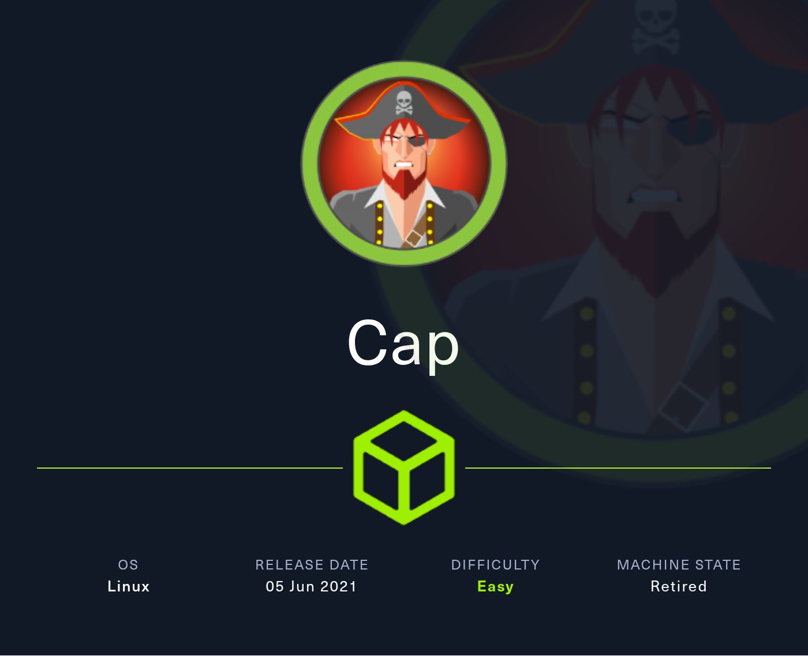
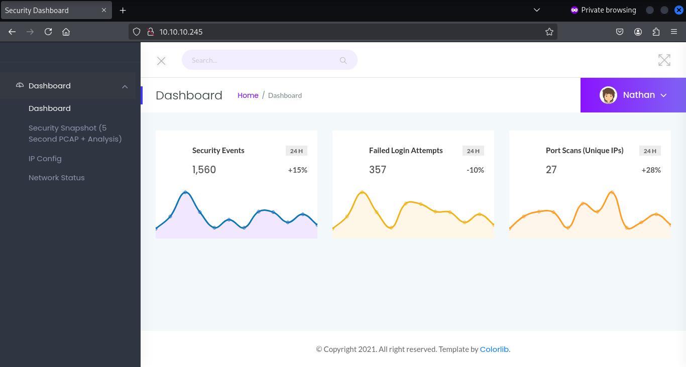

# Cap by Zayrus

System-Info: Cap es una máquina Linux de dificultad fácil que ejecuta un servidor HTTP que realiza funciones administrativas, incluyendo la realización de capturas de red. Controles inadecuados resultan en una Referencia Directa a Objeto Insegura (IDOR) que da acceso a la captura de otro usuario



# 🧠 **Skills necesarias** 🧠

### 🔍 *Reconocimiento y Enumeración de Servicios*

- Uso de `nmap` (con flags como `p-`, `sSCV`, `-min-rate`, etc.).
- Capacidad para interpretar resultados de escaneo (identificar servicios como FTP, HTTP, SSH).

### 🌐 *Enumeración Web*

- Conocimiento del uso de herramientas como `WhatWeb`, `Gobuster`, `wfuzz`.
- Interpretación de rutas expuestas (`/ip`, `/data`, `/netstat`, etc.).
- Identificación de endpoints que pueden llevar a filtraciones de información (incluso numéricamente indexados).

### 🧪 *Fuzzing y Enumeración DirBuster-Style*

- Creación y uso de diccionarios personalizados (`seq`, `wordlists`).
- Comprensión de HTTP status codes (ej. distinguir entre 200 y 404).
- Interpretación de resultados para descubrir archivos/recursos valiosos.

### 📡 *Análisis de Tráfico y Protocolos*

- Manejo básico/intermedio de Wireshark.
- Comprensión del protocolo FTP, especialmente cómo transmite en texto plano.
- Extracción manual de credenciales de capturas `.pcap`.

### 🛠️ *Acceso Inicial y Movimiento Lateral*

- Uso de credenciales para conectarse por SSH o FTP.
- Identificación de cuentas válidas y contraseñas a partir de la información obtenida.

### 🛡️ ***Escalada de privilegios***

- Detección de capacidades peligrosas (`cap_setuid+eip` con `getcap`).
- Explotación de capabilities para obtener shell como root.
- Conocimiento de binarios que permiten setuid (como Python).

# 🔎RECONOCIMIENTO🔎

## 🔎Se realiza un ping a la maquina 10.10.10.245 🔎

```bash
ping -c 1 10.10.10.245 
PING 10.10.10.245 (10.10.10.245) 56(84) bytes of data.
64 bytes from 10.10.10.245: icmp_seq=1 ttl=63 time=218 ms

--- 10.10.10.245 ping statistics ---
1 packets transmitted, 1 received, 0% packet loss, time 0ms
rtt min/avg/max/mdev = 217.609/217.609/217.609/0.000 ms
```

- **Explicación:**
    - `ping`: Ejecuta la herramienta `ping`.
    - `c1`: Le dice a `ping` que solo envíe **1 paquete** (por defecto, sigue enviando paquetes indefinidamente).
    - `10.10.10.245`: Es la dirección IP (o nombre de host) del destino al que quieres hacer ping.
- **Interpretación del resultado:**
    - Al enviar este paquetes ICMP, vemos que el Tiempo De Vida (TTL) es de aproximadamente 64 segundos. Esto indica que el objetivo debería ser un sistema Linux, mientras que los sistemas Windows usualmente tienen un TTL de 128 segundos.
    

## 📊Escaneo con nmap 🔎

```bash
nmap -p- --open -sSCV --min-rate 5000 -vvv -n -Pn 10.10.10.245 -oN Scan

```

```bash
# Nmap 7.95 scan initiated Thu May  1 12:50:43 2025 as: /usr/lib/nmap/nmap --privileged -p- --open -sSCV --min-rate 5000 -vvv -n -Pn -oN Scan 10.10.10.245
Nmap scan report for 10.10.10.245
Host is up, received user-set (0.13s latency).
Scanned at 2025-05-01 12:50:43 -05 for 42s
Not shown: 59611 closed tcp ports (reset), 5921 filtered tcp ports (no-response)
Some closed ports may be reported as filtered due to --defeat-rst-ratelimit
PORT   STATE SERVICE REASON         VERSION
21/tcp open  ftp     syn-ack ttl 63 vsftpd 3.0.3
22/tcp open  ssh     syn-ack ttl 63 OpenSSH 8.2p1 Ubuntu 4ubuntu0.2 (Ubuntu Linux; protocol 2.0)
| ssh-hostkey: 
|   3072 fa:80:a9:b2:ca:3b:88:69:a4:28:9e:39:0d:27:d5:75 (RSA)
| ssh-rsa AAAAB3NzaC1yc2EAAAADAQABAAABgQC2vrva1a+HtV5SnbxxtZSs+D8/EXPL2wiqOUG2ngq9zaPlF6cuLX3P2QYvGfh5bcAIVjIqNUmmc1eSHVxtbmNEQjyJdjZOP4i2IfX/RZUA18dWTfEWlNaoVDGBsc8zunvFk3nkyaynnXmlH7n3BLb1nRNyxtouW+q7VzhA6YK3ziOD6tXT7MMnDU7CfG1PfMqdU297OVP35BODg1gZawthjxMi5i5R1g3nyODudFoWaHu9GZ3D/dSQbMAxsly98L1Wr6YJ6M6xfqDurgOAl9i6TZ4zx93c/h1MO+mKH7EobPR/ZWrFGLeVFZbB6jYEflCty8W8Dwr7HOdF1gULr+Mj+BcykLlzPoEhD7YqjRBm8SHdicPP1huq+/3tN7Q/IOf68NNJDdeq6QuGKh1CKqloT/+QZzZcJRubxULUg8YLGsYUHd1umySv4cHHEXRl7vcZJst78eBqnYUtN3MweQr4ga1kQP4YZK5qUQCTPPmrKMa9NPh1sjHSdS8IwiH12V0=
|   256 96:d8:f8:e3:e8:f7:71:36:c5:49:d5:9d:b6:a4:c9:0c (ECDSA)
| ecdsa-sha2-nistp256 AAAAE2VjZHNhLXNoYTItbmlzdHAyNTYAAAAIbmlzdHAyNTYAAABBBDqG/RCH23t5Pr9sw6dCqvySMHEjxwCfMzBDypoNIMIa8iKYAe84s/X7vDbA9T/vtGDYzS+fw8I5MAGpX8deeKI=
|   256 3f:d0:ff:91:eb:3b:f6:e1:9f:2e:8d:de:b3:de:b2:18 (ED25519)
|_ssh-ed25519 AAAAC3NzaC1lZDI1NTE5AAAAIPbLTiQl+6W0EOi8vS+sByUiZdBsuz0v/7zITtSuaTFH
80/tcp open  http    syn-ack ttl 63 Gunicorn
|_http-title: Security Dashboard
| http-methods: 
|_  Supported Methods: HEAD OPTIONS GET
|_http-server-header: gunicorn
Service Info: OSs: Unix, Linux; CPE: cpe:/o:linux:linux_kernel

Read data files from: /usr/share/nmap
Service detection performed. Please report any incorrect results at https://nmap.org/submit/ .
# Nmap done at Thu May  1 12:51:25 2025 -- 1 IP address (1 host up) scanned in 42.21 seconds

```

### Desglose de los parámetros:

- `-p-`: Escanea **todos los puertos TCP** (del 1 al 65535).
- `--open`: Solo muestra los **puertos abiertos**.
- `-sSCV`: Tres opciones combinadas:
    - `sS`: Escaneo TCP SYN (rápido y sigiloso).
    - `sC`: Usa **scripts NSE por defecto** (como detección de versiones o banners).
    - `sV`: Detecta **versiones de servicios**.
- `--min-rate 5000`: Fuerza una tasa mínima de envío de paquetes (5000 por segundo), para mayor velocidad.
- `vvv`: Modo muy detallado (verbose).
- `n`: No hace resolución DNS.
- `Pn`: Omite el "ping" inicial (asume que el host está **activo**).
- `oN Scan`: Guarda la salida en el archivo `Scan`.

## 🔐 Puertos abiertos y servicios

| Puerto | Estado | Servicio | Versión detectada | Detalles |
| --- | --- | --- | --- | --- |
| 21 | open | FTP | vsftpd 3.0.3 | Protocolo de transferencia de archivos. Potencial vector de ataque si permite acceso anónimo. |
| 22 | open | SSH | OpenSSH 8.2p1 (Ubuntu) | Acceso remoto seguro. Claves públicas SSH también mostradas. |
| 80 | open | HTTP | Gunicorn | Servidor HTTP que muestra un sitio con título "Security Dashboard". |

### 🔑 Claves SSH:

Se listan las **claves públicas del servidor SSH**, útiles para verificar integridad, ataques MITM o fingerprinting:

- RSA, ECDSA, ED25519 — esto es normal y se usa para identificación del servidor.

### 🌐 HTTP (Puerto 80)

- Título de la página: `Security Dashboard`
- Servidor: `Gunicorn` (servidor WSGI para apps Python).
- Métodos soportados: `HEAD`, `OPTIONS`, `GET`

Esto indica que probablemente haya una **aplicación web en Python** (como Flask o Django) corriendo.

### 🧠Conclusión

Este servidor tiene al menos 3 servicios activos y detectables:

1. FTP en el puerto 21 (posible punto débil).
2. SSH en el puerto 22 (acceso remoto, protegido por clave).
3. Una web (probablemente en Flask/Django) en el puerto 80.

## 🌍 Whatweb

**WhatWeb** es una herramienta de análisis web diseñada para identificar **tecnologías utilizadas por un sitio web**. Puede detectar frameworks, sistemas de gestión de contenido (CMS), servidores web, lenguajes de programación, bibliotecas JavaScript, servicios de análisis, y mucho más

### 🔧 ¿Para qué sirve?

Te permite responder preguntas como:

- ¿Está usando WordPress, Joomla, Drupal, etc.?
- ¿Qué servidor web corre? (Apache, Nginx, IIS…)
- ¿Está usando jQuery, Bootstrap, Google Analytics…?)
- ¿Cuál es la versión del CMS, del servidor o de ciertos plugins?
- ¿Hay cabeceras HTTP interesantes (cookies, CORS, seguridad)?
- ¿Se puede detectar algún componente vulnerable?

### 🧠 ¿Cuándo usar WhatWeb?

- **Reconocimiento inicial** en un test de penetración.
- **Fingerprinting** de la superficie de ataque web.
- **Enumeración pasiva**, sin hacer mucho ruido.
- **Detección de tecnologías** para planificación de ataques específicos (por ejemplo, explotar una versión vulnerable de WordPress).

```bash
whatweb http://10.10.10.245

http://10.10.10.245 [200 OK] Bootstrap, Country[RESERVED][ZZ], HTML5, HTTPServer[gunicorn], IP[10.10.10.245], JQuery[2.2.4], Modernizr[2.8.3.min], Script, Title[Security Dashboard], X-UA-Compatible[ie=edge]

```

### 🧾 Interpretación:

| Campo | Significado |
| --- | --- |
| `http://10.10.10.245` | URL del sitio escaneado. |
| `[200 OK]` | El servidor respondió con un estado HTTP 200 (respuesta exitosa). |
| `Bootstrap` | El sitio usa **Bootstrap** (framework de diseño responsivo y CSS). |
| `Country[RESERVED][ZZ]` | La IP es privada o reservada (como una red interna, por eso no tiene país). |
| `HTML5` | El sitio está desarrollado con **HTML5**. |
| `HTTPServer[gunicorn]` | El servidor HTTP es **Gunicorn** (servidor WSGI para apps Python, como Flask o Django). |
| `IP[10.10.10.245]` | Dirección IP del servidor. |
| `JQuery[2.2.4]` | Usa **jQuery** versión 2.2.4. |
| `Modernizr[2.8.3.min]` | Usa **Modernizr**, herramienta JS para detectar características de HTML5/CSS3. |
| `Script` | Se detectaron scripts JavaScript cargados (sin identificar más detalle). |
| `Title[Security Dashboard]` | El título de la página es **"Security Dashboard"**. |
| `X-UA-Compatible[ie=edge]` | Cabecera que fuerza a usar la última versión del motor de IE (compatibilidad). |

### 💡 ¿Qué te dice esto?

- El sitio parece ser una aplicación web moderna, probablemente hecha en **Python (Flask o Django)**.
- Utiliza **Bootstrap y jQuery**, lo que indica una interfaz web interactiva.
- No se detecta ningún CMS, pero hay suficientes pistas tecnológicas para empezar a buscar vulnerabilidades en bibliotecas o en la lógica de la app.

## 🔎Explorando el servicio HTTP (Pagina web)

## 🕵️‍♂️ Gobuster

**`Gobuster`** es una herramienta de **fuerza bruta** muy usada en pruebas de penetración y hacking ético para descubrir recursos ocultos en servidores web o servicios. Es rápida, escrita en Go, y muy útil en la fase de **enumeración**.

## 🧠 ¿Para qué sirve Gobuster?

Principalmente para **descubrir contenido oculto** o no listado en un sitio web, como:

- Directorios o archivos (por ejemplo: `/admin`, `/login.php`, `/backup.zip`)
- Subdominios
- Archivos comunes (PDFs, zips, backups, etc.)
- Rutas en APIs

## 🔧 Módulos principales de Gobuster

1. **dir**: Enumeración de directorios y archivos en sitios web.
2. **dns**: Fuerza subdominios en nombres de dominio.
3. **vhost**: Enumeración de virtual hosts.
4. **s3**: Descubre buckets de Amazon S3.
5. **fuzz**: Fuerza rutas personalizadas (modo de fuzzing).

## 🛑 ¿Cuándo usarlo?

- Durante pruebas de seguridad o CTFs para encontrar:
    - Paneles de administración ocultos.
    - Archivos de configuración o respaldo.
    - APIs expuestas.
- Antes de intentar explotación, para aumentar superficie de ataque.

```bash
gobuster dir -u http://10.10.10.245 -w /usr/share/wordlists/dirb/common.txt
```

### 🧩 Desglose de cada parte:

| Parte del comando | Significado |
| --- | --- |
| `gobuster` | Ejecuta la herramienta Gobuster. |
| `dir` | Usa el modo de **enumeración de directorios y archivos**. |
| `-u http://10.10.10.245` | Define la URL objetivo. En este caso, una máquina en red privada. |
| `-w /usr/share/wordlists/dirb/common.txt` | Usa un **diccionario de palabras** común para probar nombres de rutas. |

```bash
===============================================================
Gobuster v3.6
by OJ Reeves (@TheColonial) & Christian Mehlmauer (@firefart)
[+] Url: http://10.10.10.245
[+] Method: GET
[+] Threads: 10
[+] Wordlist: /usr/share/wordlists/dirb/common.txt
[+] Negative Status codes: 404
[+] User Agent: gobuster/3.6
[+] Timeout: 10s
Starting gobuster in directory enumeration mode
/data (Status: 302) [Size: 208] [--> http://10.10.10.245/]
/ip (Status: 200) [Size: 17463]
/netstat (Status: 200) [Size: 32787]
Progress: 4614 / 4615 (99.98%)
Finished
```

### 🧾 Rutas encontradas:

| Ruta | Código | Tamaño | Significado |
| --- | --- | --- | --- |
| `/data` | 302 | 208 | **Redirección**. El servidor responde con "Found" y redirige a `/`. Esto puede significar que `/data` es una ruta protegida o controlada. |
| `/ip` | 200 | 17463 | **Ruta válida**. Responde correctamente y devuelve un contenido (probablemente datos en texto plano o JSON). |
| `/netstat` | 200 | 32787 | También válida. Puede mostrar información del sistema, como conexiones de red (¡potencialmente sensible!). |



Usuario: Nathan


El directorio **`/ip`** muestra el **resultado del comando `ifconfig`**, revelando información sobre interfaces de red, IPs privadas y posibles rutas internas.


El directorio **`/netstat`** muestra el **output del comando `netstat`**, lo cual permite conocer puertos abiertos, conexiones activas y servicios en escucha en el sistema.


El directorio **`/data/*`** muestra **archivos `.pcap` generados dinámicamente**, que contienen capturas de tráfico de red. Estas pueden incluir credenciales, sesiones o información sensible, y representan un **riesgo crítico** si se analizan con herramientas como Wireshark.

## 🎯 Fuzzing

**Fuzzing** (o **fuzz testing**) es una técnica de **pruebas de seguridad** usada para **descubrir fallos, vulnerabilidades o comportamientos inesperados** en aplicaciones enviando **datos aleatorios, maliciosos o inválidos** como entrada.

## 🎯 ¿Para qué se usa?

- Para **detectar errores** de programación.
- Para encontrar vulnerabilidades como:
    - Desbordamientos de búfer
    - Inyecciones
    - Fallos de validación de entrada
    - Caídas del sistema o de la aplicación
- En pruebas de seguridad de aplicaciones web, APIs, binarios, etc.

## 🧪 ¿Cómo funciona?

Un **fuzzer** envía automáticamente muchos valores como:

- Cadenas largas
- Caracteres especiales
- Datos fuera de rango
- Combinaciones inesperadas

Y luego observa **cómo reacciona** la aplicación (errores, respuestas extrañas, cuelgues, etc.).

## 🛠️ Herramientas comunes

- Para web: `ffuf`, `wfuzz`, `burp suite` (Intruder), `dirsearch`
- Para binarios: `AFL`, `libFuzzer`, `boofuzz`

```bash
wfuzz -c --hc 404,302 -t 400 -u http://10.10.10.245/data/FUZZ -w numeros.txt
```

### 🔍 Desglose del comando

| Opción | Significado |
| --- | --- |
| `wfuzz` | Ejecuta la herramienta Wfuzz para fuzzing. |
| `-c` | Activa **salida con colores** para facilitar la lectura en la terminal. |
| `--hc 404,302` | **Oculta** (hide codes) las respuestas HTTP con **códigos 404** (no encontrado) y **302** (redirección). |
| `-t 400` | Usa **400 hilos** concurrentes (muy alto, útil para velocidad pero puede ser inestable si el servidor es lento). |
| `-u http://10.10.10.245/data/FUZZ` | URL objetivo donde la palabra **`FUZZ`** será reemplazada por los valores del diccionario. |
| `-w numeros.txt` | Usa el archivo `numeros.txt` como **diccionario de payloads**, por ejemplo del 0 al 1000. |
- El archivo numeros txt fue creado con el siguiente comando:

```bash
 seq 0 1000 > numeros.txt
```


## ✅ Conclusión:

Wfuzz probó **1001 rutas** (del 0 al 1000) y encontró **22 rutas válidas** que devolvieron **respuesta 200 OK**, lo que significa que **existen esos archivos o endpoints en el servidor**.

Estas rutas probablemente devuelven archivos `.pcap` u otra información. El siguiente paso sería acceder o descargar estas URLs para analizarlas (por ejemplo, con `wget`, `curl`, o desde un navegador).

## 🦈 Whireshark 🦈

**Wireshark** es una herramienta de **análisis de protocolos de red** que permite capturar y examinar en detalle el tráfico que circula por una red informática.

## 🧠 ¿Para qué sirve Wireshark?

Sirve para **inspeccionar paquetes de red** en tiempo real o desde archivos `.pcap` capturados previamente. Es ampliamente usado por:

## 🔍 Funciones principales de Wireshark

| Función | Descripción |
| --- | --- |
| 📥 **Captura de tráfico** | Escanea la red y captura todos los paquetes que pasan por la interfaz. |
| 🔍 **Análisis de paquetes** | Muestra cada paquete con detalles: IPs, protocolos, puertos, contenido, etc. |
| 🔎 **Filtros de visualización** | Usa filtros (ej: `http`, `ip.addr == 192.168.1.1`) para buscar tráfico específico. |
| 🧩 **Soporte de múltiples protocolos** | Soporta más de 2000 protocolos: TCP, UDP, HTTP, FTP, DNS, etc. |
| 📁 **Lectura de archivos `.pcap`** | Puede abrir archivos capturados por tcpdump, tshark, etc. |
| 🔑 **Descifrado de tráfico** | Puede descifrar algunos protocolos (SSL/TLS) si tienes las claves. |
| 🔄 **Reensamblaje de sesiones** | Permite reconstruir archivos, imágenes o sesiones de navegación HTTP. |

## 📄 Analisis de los archivos pcap 📄

- Descargamos el archivo .pcap de la ruta:
    - [http://10.10.10.245/data/0](http://10.10.10.245/data/0)
- Analizamos este archivo con WireShark


📄**Análisis .pcap**

En el archivo .pcap capturado se observan las credenciales en texto claro:

Usuario: Nathan

Password: Buck3tH4TF0RM3!

Debido a que el protocolo **FTP no cifra la comunicación**, permitiendo su interceptación fácilmente.

# 🎯INTRUSION🎯

## 📦Conexión mediante el puerto 21 (FTP)📦

- **FTP (File Transfer Protocol)** es un protocolo para **transferir archivos** entre un cliente y un servidor.
- Por defecto usa los **puertos:**
    - **21/TCP** → Control (inicio de sesión, comandos).
    - **20/TCP** → Transferencia de datos (modo activo).

### 🔓 Vulnerabilidades comunes en FTP:

1. **Transmisión sin cifrado (texto plano):**
    - Usuario y contraseña pueden ser **interceptados fácilmente** con herramientas como Wireshark.
    - Ejemplo: `usuario:contraseña` visibles en la red.
2. **Acceso anónimo mal configurado:**
    - Permite ingresar sin autenticación.
    - Puede exponer archivos sensibles.
3. **Fuerza bruta de credenciales:**
    - Ataques automatizados para descubrir usuarios y contraseñas.
4. **Versión obsoleta o vulnerable:**
    - FTP servers como `vsftpd` o `proftpd` pueden tener **exploits conocidos**.
5. **Permisos mal configurados:**
    - Permiten subir, modificar o borrar archivos sin control.

Usando las credenciales `nathan:Buck3tH4TF0RM3!` accedemos por ftp:


- Intentamos conectarnos al otro puerto que esta abierto, el 22 (ssh), con las credenciales de nathan.

## 🔐Conexión mediante el puerto 22 (SSH)🔐

**SSH (Secure Shell)** es un protocolo de red utilizado para acceder de forma **segura** a máquinas remotas y administrar sistemas.

### 🧩 Características clave:

- 🔒 **Cifrado:** Todo el tráfico (incluyendo contraseñas y comandos) va encriptado.
- 👨‍💻 **Acceso remoto:** Permite abrir una terminal en otro sistema de forma segura.
- 📁 **Transferencia de archivos segura:** Con comandos como `scp` o `sftp`.
- 🔑 **Autenticación por clave pública/privada** o contraseña.
- 📡 **Puerto por defecto:** **22/TCP**

### 🛡️ Seguridad:

SSH reemplaza protocolos antiguos e inseguros como **Telnet** y **FTP**, porque **protege contra ataques de sniffing, hijacking y MITM**.

```bash
ssh nathan@10.10.10.245
```


## 🧨Escalada de privilegios🧨

A la hora de escalar privilegios el nombre de la máquina `cap` nos puede dar una pequeña pista. Eso es,  [Capabilities](https://www.hackingarticles.in/linux-privilege-escalation-using-capabilities/)).

**Capabilities** (capacidades) son una forma de dividir los privilegios de *root* en **módulos individuales**, para que un proceso pueda tener **solo los permisos que necesita**, en lugar de todos los privilegios del superusuario.

### 🛠️ ¿Para qué sirven?

Permiten ejecutar tareas privilegiadas **sin ser root** completo.

Esto mejora la **seguridad** al reducir la superficie de ataque.

- Buscar capailities en el sistema:

```bash
getcap / -r 2>/dev/null
/usr/bin/python3.8 = cap_setuid,cap_net_bind_service+eip
/usr/bin/ping = cap_net_raw+ep
/usr/bin/traceroute6.iputils = cap_net_raw+ep
/usr/bin/mtr-packet = cap_net_raw+ep
/usr/lib/x86_64-linux-gnu/gstreamer1.0/gstreamer-1.0/gst-ptp-helper = cap_net_bind_service,cap_net_admin+ep

```

### 🧾 Explicación:

- `getcap`:
    
    Lista las **capabilities** asignadas a archivos ejecutables en Linux.
    
- `/`:
    
    Indica que el escaneo comienza desde el **directorio raíz** (todo el sistema de archivos).
    
- `r`:
    
    Realiza una búsqueda **recursiva** en todos los subdirectorios.
    
- `2>/dev/null`:
    
    Redirige los **errores (stderr)** a `/dev/null`, es decir, **los oculta**.
    
    Esto evita que se muestren mensajes como “Permiso denegado” o “archivo no encontrado”.
    

De esos binarios, **el más interesante para escalar privilegios es**:

🔥 `/usr/bin/python3.8 = cap_setuid+eip`

### 📌 ¿Por qué?

- La capability `*cap_setuid**` permite a un binario **cambiar su ID de usuario efectivo (EUID)**.
- Si no hay restricciones adicionales, **se puede cambiar a root (UID 0)**.

### 🛡️ Los demás binarios:

- `/usr/bin/ping`, `mtr-packet`, `traceroute6.iputils`:
    
    Solo tienen `cap_net_raw`, que permite enviar paquetes (útil para redes, **no para escalar privilegios**).
    
- `gst-ptp-helper`:
    
    Tiene `cap_net_bind_service` y `cap_net_admin`, útil para redireccionar tráfico o hacer ataques de red, pero **no para escalar directamente**.
    

### 🔥ROOT🔥

```bash
/usr/bin/python3.8 -c 'import os; os.setuid(0); os.system("/bin/bash")'
```

- Se obtendra la shell de root al ejecutarlo.
- El comando fue encontrado en GTFOBINS


### 🧩 Desglose línea por línea:

- `/usr/bin/python3.8`:
    
    Ejecuta el intérprete de Python versión 3.8.
    
- `c`:
    
    Permite ejecutar código Python directamente desde la línea de comandos.
    
- `'import os; os.setuid(0); os.system("/bin/bash")'`:
    
    Este es el código Python que se ejecuta:
    
    1. `import os`: importa el módulo del sistema operativo.
    2. `os.setuid(0)`: cambia el UID (User ID) efectivo a **0**, que es el **usuario root**.
    3. `os.system("/bin/bash")`: abre una **shell interactiva** (bash).
    

# ✅ CONCLUSIÓN ✅

**1. Enumeración inicial:**

- **Puertos abiertos:**
    - `21 (FTP)` — vsftpd 3.0.3 (sin cifrado)
    - `22 (SSH)` — OpenSSH 8.2p1
    - `80 (HTTP)` — Gunicorn con dashboard web

**2. Revisión de servicios web:**

- El sitio incluye rutas expuestas:
    - `/ip` → Muestra salida de `ifconfig`
    - `/netstat` → Muestra salida de `netstat`
    - `/data/*` → Muestra archivos `.pcap` generados dinámicamente

**3. Fuzzing y descubrimiento:**

- Con **Gobuster** y **Wfuzz**, se identificaron rutas y archivos `.pcap` en `/data/`.
- Dentro de los `.pcap`, se encontraron credenciales FTP:

Usuario: nathan
Contraseña: Buck3tH4TF0RM3!

**4. Acceso inicial:**

- Con esas credenciales, se accedió vía **FTP** al sistema.
- FTP sin cifrado → Captura de credenciales en texto claro (vulnerabilidad grave).

**5. Escalada de privilegios:**

- Se encontró una **capability peligrosa**:

```bash
/usr/bin/python3.8 = cap_setuid+eip
```

- Usando ese binario, se pudo ejecutar:

```bash
/usr/bin/python3.8 -c 'import os; os.setuid(0); os.system("/bin/bash")'
```

### 🔐 **Resumen de vulnerabilidades clave:**

| Tipo | Descripción |
| --- | --- |
| FTP inseguro | Permite robar credenciales vía sniffing |
| Web mal configurada | Expone rutas con información sensible |
| Capabilities mal usadas | Permite escalada de privilegios sin root |
